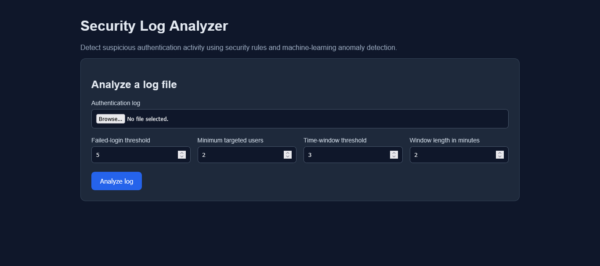

# Security Log Analyzer


A Python security application that analyzes authentication logs and detects suspicious login activity using configurable security rules and machine-learning anomaly detection.

The project provides:

- A command-line interface
- A REST API built with FastAPI
- PostgreSQL persistence for analyses and anomaly results
- Database migrations with Alembic
- A browser dashboard
- Rule-based brute-force detection
- Isolation Forest anomaly detection
- Automated tests with GitHub Actions
- Docker and Docker Compose support

## Features

### Rule-based detection

The analyzer detects:

- IP addresses with many failed login attempts
- IP addresses targeting multiple usernames
- Repeated failures within a configurable time window

### Machine-learning anomaly detection

The project uses scikit-learn's `IsolationForest` to identify IP addresses whose behavior differs significantly from other IP addresses.

The model considers:

- Total login attempts
- Failed login attempts
- Number of unique targeted users
- Failed-login ratio

Machine-learning results are treated as additional investigation signals, not definitive proof of malicious activity.

### Interfaces & Database Persistence

The analysis logic is available through:

- A Python command-line interface
- FastAPI REST endpoints (`/analyze`, `/analyses`, `/analyses/{id}`)
- An interactive browser dashboard
- PostgreSQL database persistence using SQLAlchemy and Alembic

## Technology Stack

- Python 3.14
- FastAPI & Uvicorn
- PostgreSQL & SQLAlchemy ORM
- Alembic Database Migrations
- scikit-learn
- Docker & Docker Compose
- GitHub Actions
- Python `unittest` / `pytest`

## Architecture & Persistence Layer

Database operations are completely decoupled from API routes through a Repository design pattern (`AnalysisRepository`):

- **`src/database.py`**: Configures the SQLAlchemy database engine, session management, and `DATABASE_URL` environment variable support (with automated SQLite fallback for testing/offline environments).
- **`src/models.py`**: Defines relational ORM models:
  - `Analysis`: Stores analysis metadata (file name, timestamp, total events, threshold parameters).
  - `SuspiciousIP`: Stores detected suspicious IP addresses and failed attempt counts.
  - `MultiUserIP`: Stores IP addresses targeting multiple usernames.
  - `BruteForceIP`: Stores IP addresses triggering brute-force window rules.
  - `MLAnomaly`: Stores Isolation Forest anomaly metrics (scores, failure ratios, unique users, total attempts).
- **`src/repository.py`**: Encapsulates DB CRUD operations (`save_analysis`, `get_all_analyses`, `get_analysis_by_id`).
- **`alembic/`**: Alembic migration scripts to handle schema creation and updates.

## Setup & Running with Docker Compose

1. Copy the example environment file:
   ```bash
   cp .env.example .env
   ```
2. Start the PostgreSQL database and FastAPI service with Docker Compose:
   ```bash
   docker-compose up --build
   ```
3. Access the dashboard at `http://localhost:8000` or inspect API endpoints at `http://localhost:8000/docs`.

## Database Migrations

Database migrations are managed using **Alembic**.

When running with Docker Compose, migrations are automatically applied on startup (`alembic upgrade head`).

To manage migrations manually:

- Apply migrations:
  ```bash
  alembic upgrade head
  ```
- Generate a new migration after changing models in `src/models.py`:
  ```bash
  alembic revision --autogenerate -m "describe changes"
  ```

## Environment Variables

Configure database connections securely using environment variables (never hardcode credentials):

| Variable | Description | Default / Example |
| --- | --- | --- |
| `POSTGRES_USER` | PostgreSQL Username | `postgres` |
| `POSTGRES_PASSWORD` | PostgreSQL Password | `postgres` |
| `POSTGRES_DB` | PostgreSQL Database Name | `security_logs` |
| `POSTGRES_HOST` | Database Hostname | `db` (or `localhost`) |
| `POSTGRES_PORT` | Database Port | `5432` |
| `DATABASE_URL` | SQLAlchemy Connection URL | `postgresql://postgres:postgres@db:5432/security_logs` |

## Project Structure

```text
security-log-analyzer/
├── .github/
│   └── workflows/
│       └── tests.yml
├── alembic/
│   ├── versions/
│   └── env.py
├── data/
│   └── sample_auth.log
├── src/
│   ├── analyzer.py
│   ├── api.py
│   ├── dashboard.py
│   ├── database.py
│   ├── main.py
│   ├── ml_analyzer.py
│   ├── models.py
│   ├── parser.py
│   ├── report.py
│   └── repository.py
├── tests/
│   ├── test_analyzer.py
│   ├── test_api.py
│   ├── test_ml_analyzer.py
│   ├── test_parser.py
│   ├── test_persistence.py
│   └── test_report.py
├── .dockerignore
├── .env.example
├── .gitignore
├── alembic.ini
├── Dockerfile
├── docker-compose.yml
├── README.md
└── requirements.txt
```
